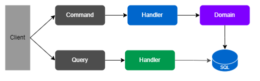
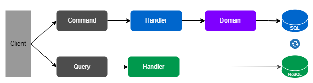
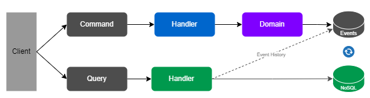
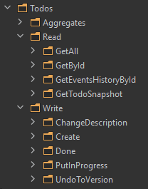

## Event Sourcing and CQRS Dotnet

## Give a Star! :star:

If you liked my work and want to support me, please give it a star. Thanks!

## Introduction

This repository is a sandbox to experiment **CQRS** and **Event Sourcing** techniques. 

## 1. How to Run :rocket:

### App
```
docker-compose -f ./infra/docker-compose.yml -p event-sourcing up -d
```

#### Swagger
```
localhost:8000/swagger
```

#### EventStoreDB GUI
```
localhost:2113
```

## 2. CQRS :on:

CQRS stands for **Command Query Responsibility Segregation**. It's a pattern described by **Greg Young**. In short is the notion that you can use different models to **write** and **read** operations. The **separation could be logic**, segregating operations at application level, or **with different databases** for write and read operations.

In the case of the **different databases approach**, you should define a synchronization alternative. The must popular are: **Eventual**, in process with **Unit of Work**, **OnDemand**, and **Scheduled**.

### 2.1 Logical Segregation


### 2.2 Separated Databases


## 3. Event Sourcing :hourglass:
"We can query an application's state to find out the **current state of the world**, and this answers many questions. **However there are times when we don't just want to see where we are, we also want to know how we got there**.

Event Sourcing ensures that **all changes to application state are stored as a sequence of events**. Not just can we **query these events**, we can also use the event log to **reconstruct past states**, and as a foundation to automatically **adjust the state to cope with retroactive changes**." _Martin Fowler_

### 3.1 Event Store


## 4. Architecture :dart:

For the app architecture I'm using a **Clean Architecture** model, splitting the solution into: **Core** for **domain modeling** and **use cases**, **Infra** for **database, IoC, Integrations** and other _infrastructure concerns_, **Services** for application **entrypoint**, and **SharedKernel** for **base stuff**. 


The organization follows  **"The Screaming Architecture"** concept by **Uncle Bob** that purposes that your application architecture should scream what the system does. So I've preferred an organization by context rather than by component type.
Also the **Use Cases** are divided into **Write** or **Read** operations. Also, any **Use Case** has its owns **Command**, **Query**, **Result**, and **Handler**.


<br>

## 5. Containers :whale:
The application is containerized using **Docker** and automated using **Docker Compose**.
I took the caution not to use default ports in containers to avoid conflict with other containers/servers that you may have using these ports.

## 6. Used Packages, Frameworks, and Tools :package:
- [ASPNET.Core](https://github.com/dotnet/aspnetcore) - Web Framework
- [Dapper](https://github.com/DapperLib/Dapper) - Micro ORM
- [Postgres](https://www.postgresql.org/) - Read Database
- [EventStorageDB](https://www.eventstore.com/eventstoredb/) - Events Storage
- [Docker](https://docs.docker.com/) - Container Management
- [Docker Compose](https://docs.docker.com/compose/) - Multi-Container Management
- [Mediatr](https://github.com/jbogard/MediatR) - Use Cases Decoupling and Behaviours Pipelines
- [FluentValidation](https://github.com/FluentValidation/FluentValidation) - Data Validation
- [MicrosoftPackages](https://github.com/orgs/dotnet/repositories) - Dependency Injection, In-Memory Database, and more

## 7. Used Patterns and Principles :books:
- [CQRS](https://martinfowler.com/bliki/CQRS.html)
- [Event Sourcing](https://martinfowler.com/eaaDev/EventSourcing.html)
- [Clean Architecture](https://blog.cleancoder.com/uncle-bob/2012/08/13/the-clean-architecture.html)
- [SOLID](https://blog.cleancoder.com/uncle-bob/2020/10/18/Solid-Relevance.html)
- [Domain Validation](https://martinfowler.com/articles/replaceThrowWithNotification.html)
- [Domain Events](https://docs.microsoft.com/en-us/dotnet/architecture/microservices/microservice-ddd-cqrs-patterns/domain-events-design-implementation)
- [Aggregates](https://martinfowler.com/bliki/DDD_Aggregate.html)
- [Value Objects](https://martinfowler.com/bliki/ValueObject.html)
- [Fail-Fast Principle](https://enterprisecraftsmanship.com/posts/fail-fast-principle/)
- [Rich Domain Modeling](https://blog.codecentric.de/en/2019/10/ddd-vs-anemic-domain-models/)
- [Mediator](https://refactoring.guru/design-patterns/mediator)
- [Repository Pattern](https://docs.microsoft.com/en-us/dotnet/architecture/microservices/microservice-ddd-cqrs-patterns/infrastructure-persistence-layer-design)
